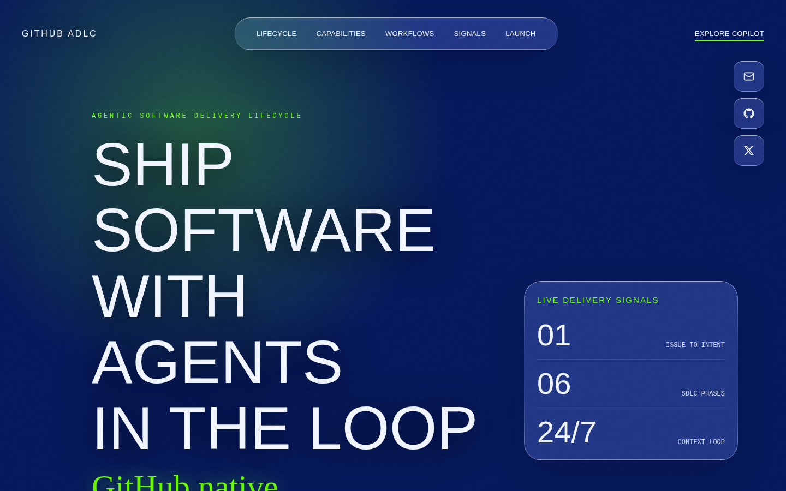
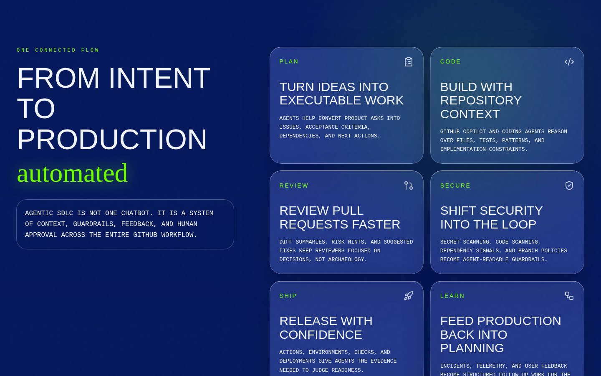
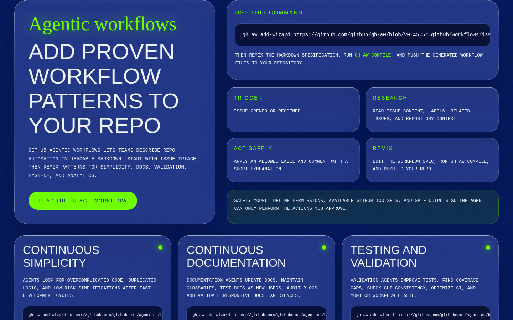
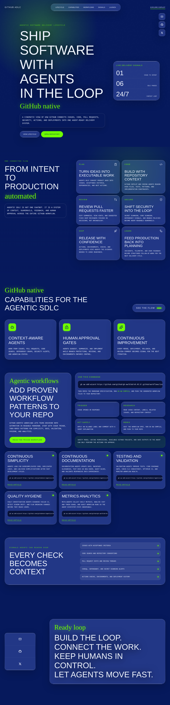

# GitHub ADLC

A React, TypeScript, Vite, and Tailwind CSS landing page explaining GitHub Agentic SDLC and GitHub Agentic Workflows with a cinematic style, video backgrounds, and liquid glass UI.

## Screenshots

### Homepage hero



### Lifecycle — From intent to production



### Agentic workflows



### Full page



## Development

Install dependencies:

```sh
npm install
```

Run locally:

```sh
npm run dev
```

Build for production:

```sh
npm run build
```
